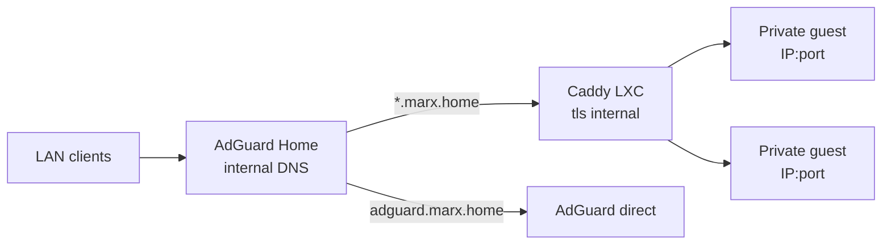
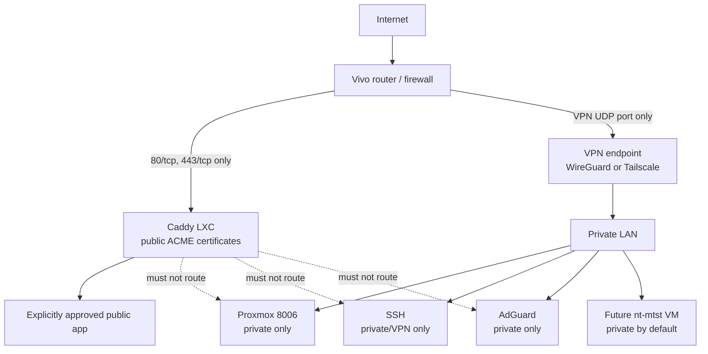
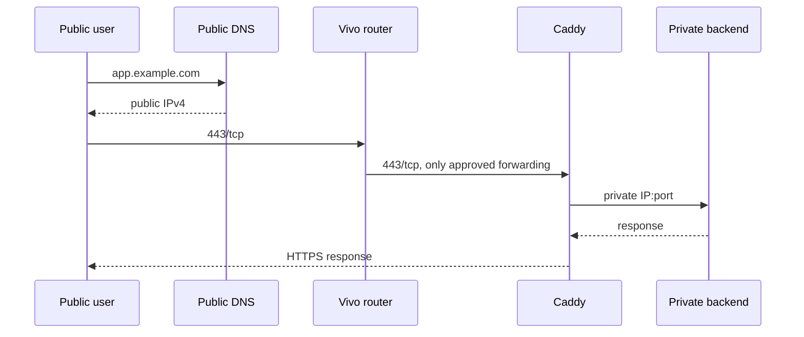
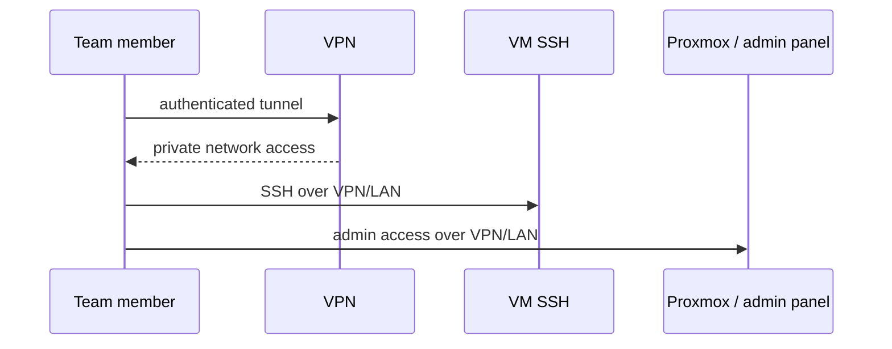

# Internet Exposure Plan

Status: draft for review.
Goal: expose selected services safely while keeping Proxmox, SSH, DNS, and admin panels private.
Non-goals: creating `nt-mtst` yet, installing Gitea Runner yet, publishing media/admin panels.

Confirmed so far:

- Router WAN IPv4 matches the public IP seen externally, so no CGNAT is blocking inbound port-forwarding.
- A public domain is available.
- No external traffic is being received yet.
- First public validation will be a disposable test page, not Gitea or another real app.
- `marx.home` remains internal-only.

## Global security posture: deny by default

This plan follows a strict least-privilege posture. Everything stays closed unless there is an explicit, reviewed reason to open it.

- Default deny on inbound traffic at every layer: router, Proxmox firewall, guest firewall, and application.
- No automatic publishing: a new guest, port, or container never becomes public by itself.
- Every public route needs an explicit allowlist entry with owner, hostname, backend, and reason.
- Admin surfaces are never public: Proxmox UI, SSH, DNS admin, AdGuard, database ports, debug ports, and unauthenticated metrics stay on LAN/VPN only.
- Outbound traffic is also minimal: DNS, NTP, updates, and the specific endpoints each public service needs.
- Each opening is time-scoped when possible, reviewed after every network or guest change, and removed when no longer needed.
- On doubt, fail closed: block first, then investigate.

## How to use this document

- Work phase by phase.
- Do not skip Phase 0.
- Commands marked `RUN ON PROXMOX` must be run on Proxmox as root.
- Router steps are manual in the Vivo modem UI.
- Check each box only after verifying the expected result.

## Current internal architecture



Important: this is currently an internal design. It is not ready for direct Internet publication because Caddy uses internal certificates, discovers guest ports automatically, and there is no documented firewall/NAT boundary.

## Target perimeter architecture



## Public versus private request flow





## Phase 0 — Read-only inventory

Objective: replace assumptions with the actual network, DNS, guest, firewall, and certificate state.

### 0.1 Proxmox and guests

`RUN ON PROXMOX`:

```bash
pveversion --verbose
ip -br addr
ip -br link
qm list
pct list
pve-firewall status
ss -lntup
iptables-save
```

Record:

- [ ] Proxmox version.
- [ ] Bridges, physical interfaces, VLANs if any.
- [ ] Every VM/LXC ID, name, status.
- [ ] Every listening TCP port and owning process/guest.
- [ ] Whether Proxmox firewall is enabled.
- [ ] Whether IPv6 addresses are globally reachable.

Expected: a complete guest/port inventory.
Done when: every listening service can be mapped to a known guest.

### 0.2 Caddy reality

`RUN ON PROXMOX`:

```bash
pct list | grep -i caddy
```

Then inspect the Caddy container configuration and Caddyfile. The generated local file is ignored by git, so inspect it on the host/container directly.

Record:

- [ ] Caddy container ID and private IP.
- [ ] Active Caddyfile entries.
- [ ] Public versus internal hostnames.
- [ ] Certificate mode for each entry.
- [ ] Data directory persistence for ACME storage.
- [ ] Orphaned routes pointing to retired guests.

Expected: no unknown public route.
Done when: every Caddy route has an owner and a reason to exist.

### 0.3 DNS reality

Record:

- [ ] Internal domain and wildcard behavior.
- [ ] Public domain and registrar.
- [ ] Existing public `A`/`AAAA` records.
- [ ] TTL values.
- [ ] Whether internal and public DNS are separated.

Expected: `marx.home` stays internal; public domain is separate.
Done when: you know exactly which names resolve publicly and internally.

### 0.4 Router reality

In the Vivo modem UI, record:

- [ ] WAN IPv4.
- [ ] Whether WAN IPv4 changes after reboot.
- [ ] Existing port-forward rules.
- [ ] UPnP/NAT-PMP state.
- [ ] IPv6 WAN/global prefix.
- [ ] DHCP range and reservations.
- [ ] Remote management/WAN access state.

Expected: no unexpected forwards; remote WAN management disabled.
Done when: the router has a written baseline.

## Phase 1 — Separate public DNS from internal DNS

Objective: prevent internal names from leaking and make public issuance predictable.

Steps:

- [ ] Keep `*.marx.home` only in AdGuard/internal DNS.
- [ ] Choose public names explicitly, for example `test.example.com`.
- [ ] Create one public `A` record for the first test.
- [ ] Use a low TTL during testing, for example 300 seconds.
- [ ] If IPv6 will be used, create the corresponding `AAAA` record.
- [ ] Verify from an external network.

Verification:

```bash
dig +short test.example.com
```

Expected: the public name resolves to the router's public IPv4.
Done when: internal and public names are documented separately.

## Phase 2 — Minimal router ingress

Objective: allow only the traffic necessary for public web and VPN.

Steps:

- [ ] Assign a stable private IP to Caddy through DHCP reservation or static configuration.
- [ ] Forward only `80/tcp` and `443/tcp` to Caddy.
- [ ] Do not forward Proxmox `8006`, SSH `22`, DNS `53`, AdGuard, or any guest port.
- [ ] Disable UPnP/NAT-PMP entirely.
- [ ] Deny all other inbound forwards; each exception needs a written reason and expiry review.
- [ ] Keep Vivo remote WAN management disabled.
- [ ] If IPv6 is globally reachable, add equivalent IPv6 firewall rules; do not assume NAT absence means safety.

Verification:

- [ ] From mobile data, public web test can reach Caddy.
- [ ] From mobile data, Proxmox/SSH/admin ports are unreachable.
- [ ] Router shows only the intended forwards.

Done when: the router exposes the smallest possible ingress surface.

## Phase 3 — Firewall baseline

Objective: deny unexpected traffic even if a router rule is wrong.

Proxmox firewall behavior to use as reference:

- Firewall is disabled by default and must be enabled deliberately.
- VM/CT firewall configuration lives under `/etc/pve/firewall/<VMID>.fw`.
- Each virtual NIC also has its own firewall enable flag.
- Rules support `IN`, `OUT`, and security groups/IP sets.
- Official reference: [Proxmox VE Firewall](https://pve.proxmox.com/pve-docs/chapter-pve-firewall.html).

Baseline to implement:

- [ ] Enable Proxmox firewall carefully without locking out local access.
- [ ] Enable firewall on Caddy's interface.
- [ ] Default inbound policy restrictive.
- [ ] Allow `80/tcp` and `443/tcp` inbound to Caddy.
- [ ] Allow established/related return traffic.
- [ ] Allow DHCP/NDP only where required.
- [ ] Allow SSH only from LAN/VPN sources.
- [ ] Enable guest firewall for sensitive VMs/LXCs.
- [ ] Make backends accept app traffic only from Caddy where possible.

Verification `RUN ON PROXMOX`:

```bash
pve-firewall status
iptables-save
ss -lntup
```

Done when: an external scan sees only intended web ports, and internal admin ports remain private.

## Phase 4 — Harden Caddy for public use

Objective: make Caddy a deliberate publishing allowlist, not an automatic guest scanner.

Current repository risk: `caddy/generate-caddyfile.sh` discovers all guests and listening ports and can create routes interactively or preserve obsolete blocks. That behavior is unsafe as a WAN publishing mechanism.

Required changes before real publication:

- [ ] Add an explicit public-service allowlist.
- [ ] Add a guest tag such as `no-auto-proxy`.
- [ ] Make the generator skip tagged guests by default.
- [ ] Require explicit approval for every public hostname.
- [ ] Preserve obsolete blocks only with a warning and manual confirmation.
- [ ] Validate the generated Caddyfile before reload.
- [ ] Keep automatic reload safe with rollback to the previous known-good file.
- [ ] Separate internal routes from public routes.
- [ ] Use public ACME certificates for public names.
- [ ] Keep `tls internal` only for internal names whose clients trust the local CA.
- [ ] Never use insecure TLS skip-verify against a backend.
- [ ] Ensure Caddy data/storage persists across container recreation for certificate renewal.

Caddy requirements for public Automatic HTTPS:

- Public DNS points to the server.
- Ports `80` and `443` reach Caddy.
- Caddy can bind to those ports or receive forwarded packets.
- Caddy storage is writable and persistent.
- Hostname appears in the Caddy configuration.

Official references:

- [Caddy Automatic HTTPS](https://caddyserver.com/docs/automatic-https).
- [Caddy `reverse_proxy`](https://caddyserver.com/docs/caddyfile/directives/reverse_proxy).

Done when: adding a new guest cannot accidentally create a public route.

## Phase 5 — Private team and admin access

Objective: give teammates access without publishing administration.

Choose one primary model first:

| Option | Best for | Trade-off |
|---|---|---|
| WireGuard | Direct control, no extra account dependency | You manage keys, firewall, availability, and revocation |
| Tailscale | Easier onboarding and centralized ACLs | Depends on Tailscale coordination/control plane |
| Cloudflare Tunnel | No inbound ports for selected web apps | Depends on Cloudflare; SSH/admin still needs a separate private path |

Recommended initial split:

- Public browser apps: Caddy.
- SSH, Proxmox, AdGuard, backend ports: VPN/LAN only.
- No direct SSH from the Internet.
- Individual user accounts.
- Separate SSH keys per person.
- No shared private keys.
- No `sudo` by default.
- No Docker socket access by default.

Steps:

- [ ] Deploy the selected VPN endpoint.
- [ ] Create one identity/key per teammate.
- [ ] Test SSH through VPN.
- [ ] Test private admin URLs through VPN.
- [ ] Document key issuance and revocation.
- [ ] Disable password SSH authentication; allow key-based authentication only.
- [ ] Add MFA to Proxmox and important web services where supported.

Done when: revoking one teammate does not require changing shared credentials.

## Phase 6 — First public smoke test

Objective: validate DNS, ingress, TLS, proxy behavior, firewall, and monitoring with no sensitive data.

Steps:

- [ ] Publish only `test.example.com`.
- [ ] Serve a static disposable response from Caddy.
- [ ] Verify certificate issuer is public.
- [ ] Verify HTTP redirects to HTTPS if that is the intended behavior.
- [ ] Verify backend headers and client IP handling.
- [ ] Test from external mobile data.
- [ ] Test from internal LAN/VPN.
- [ ] Check Caddy logs.
- [ ] Check firewall logs/drops.
- [ ] Test renewal or document renewal monitoring.
- [ ] Remove or restrict the test route after validation if it is no longer needed.

Verification checklist:

- [ ] Public DNS is correct.
- [ ] Port `80` behaves as intended.
- [ ] Port `443` serves valid public TLS.
- [ ] No admin service is reachable publicly.
- [ ] Certificate renews or has monitored expiry.
- [ ] Logs show expected requests and no unexpected admin probing success.

Done when: the full public path is proven without exposing a real workload.

## Phase 7 — Publish the first real application

Objective: roll out one low-risk app with explicit ownership and rollback.

For each candidate app, record:

- [ ] Public hostname.
- [ ] Backend private IP and port.
- [ ] Protocol: HTTP or HTTPS.
- [ ] Authentication method.
- [ ] Whether it needs websockets/long-lived connections.
- [ ] Upload size limits.
- [ ] Rate-limit needs.
- [ ] Log retention needs.
- [ ] Backup/restore procedure.
- [ ] Owner responsible for updates.

Do not publish in the first rollout:

- Proxmox UI.
- SSH.
- AdGuard admin/API.
- qBittorrent admin unless it has strong auth, allowlist, and a reviewed reason.
- Starr admin panels unless they are explicitly approved and protected.
- Database ports.
- Development/debug ports.
- Metrics endpoints without authentication/firewall restriction.

Backend trust steps:

- [ ] Configure the app to trust Caddy as its proxy where applicable.
- [ ] Set correct public external URL/`ROOT_URL`-style setting.
- [ ] Preserve host/proto headers correctly.
- [ ] Test login, logout, password reset, uploads, and timeouts.
- [ ] Test behavior when the backend is stopped.
- [ ] Document rollback: previous Caddyfile plus backend snapshot/backup.

Done when: one real app is public, monitored, backed up, and reversible.

## Phase 8 — Operate the perimeter

Objective: keep exposure safe over time.

Recurring controls:

- [ ] Update Proxmox/host packages.
- [ ] Update guests, Caddy, VPN, and published apps.
- [ ] Review firewall rules after every network change.
- [ ] Review Caddy routes after every guest change.
- [ ] Review DNS records quarterly or after every migration.
- [ ] Monitor certificate expiry.
- [ ] Monitor disk, especially Caddy, logs, Docker/cache, and backups.
- [ ] Monitor failed SSH/VPN/admin logins.
- [ ] Rotate credentials after team changes.
- [ ] Test restore from backup.
- [ ] Keep a secrets inventory: where tokens, ACME data, VPN keys, and SSH keys live.

Suggested lightweight monitoring:

- Caddy process and certificate status.
- VPN endpoint availability.
- Public endpoint status from an external check.
- Firewall deny-rate anomalies.
- SMART/disk/pool health.
- Backup success/failure.

Done when: updates, backups, logs, and access reviews are routine rather than ad hoc.

## Phase 9 — Add `nt-mtst` only after the perimeter is stable

Objective: prevent the team VM from inheriting an unfinished perimeter.

Gate conditions:

- [ ] Phases 0–6 are complete.
- [ ] Caddy has an explicit allowlist.
- [ ] VPN access works.
- [ ] Firewall baseline is active.
- [ ] No admin service is publicly reachable.
- [ ] `nt-mtst` has private networking by default.
- [ ] `nt-mtst` firewall allows SSH only from VPN/LAN.
- [ ] `nt-mtst` has individual users and keys.
- [ ] Gitea Runner remains optional and is not installed by the base VM script.

Done when: `nt-mtst` can be created without changing public ingress rules.

## Information still needed

- Vivo modem model.
- Whether the public IPv4 is static or dynamic.
- DHCP reservation method used for Caddy.
- Caddy private IP.
- Public domain and desired first test hostname.
- Selected VPN option.
- List of apps approved for eventual publication.
- Backup location and retention policy.
