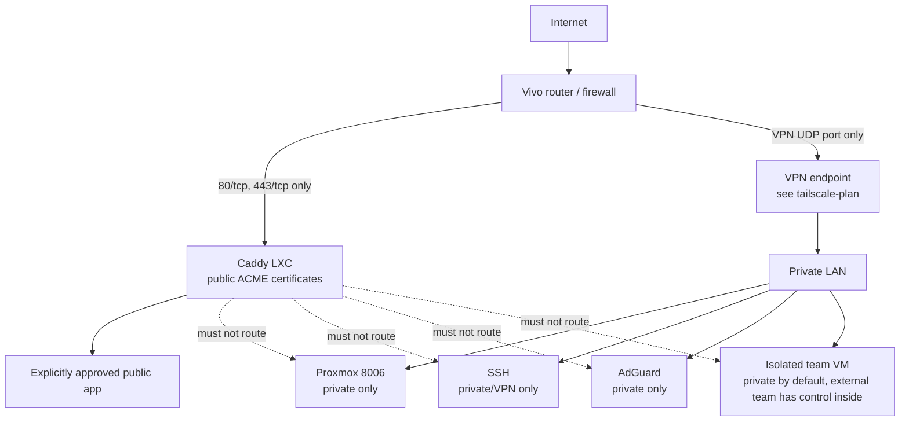

# Internet Exposure Plan

Status: draft for review.
Goal: expose selected services safely while keeping Proxmox, SSH, DNS, and admin panels private.
Non-goals: publishing media/admin panels.

Confirmed so far:

- Router WAN IPv4 matches the public IP seen externally, so no CGNAT blocks inbound port-forwarding.
- A public domain is available.
- No external traffic is being received yet.
- First public validation will be a disposable test page, not a real app.
- `marx.home` remains internal-only.

## Security posture: deny by default

- Default deny inbound at every layer: router, Proxmox firewall, guest firewall, app.
- No automatic publishing: a new guest, port, or container never becomes public by itself.
- Every public route needs an explicit allowlist entry with owner, hostname, backend, and reason.
- Admin surfaces stay on LAN/VPN only: Proxmox UI, SSH, DNS admin, AdGuard, database, debug, and unauthenticated metrics ports.
- On doubt, fail closed.

Work phase by phase; commands marked `RUN ON PROXMOX` run on Proxmox as root. Check each box only after verifying.

## Target perimeter architecture

Public flow: public DNS → router `443/tcp` → Caddy → private backend. Private flow: teammate → VPN → SSH or private URL. No direct SSH from the Internet.

## Phase 0 — Read-only inventory

`RUN ON PROXMOX`: `pveversion --verbose`, `ip -br addr`, `qm list`, `pct list`, `pve-firewall status`, `ss -lntup`.

- [ ] Map every VM/LXC and listening port to a known guest.
- [ ] Record Caddy container ID, IP, active routes, cert mode, and orphaned routes.
- [ ] Record internal vs public DNS zones, records, and TTLs (`marx.home` internal-only).
- [ ] Baseline the Vivo router: WAN IP, forwards, UPnP state, DHCP reservations, remote WAN management off.

Done when: every listening service and DNS name has a known owner.

## Phase 1 — Separate public DNS from internal DNS

- [ ] Keep `*.marx.home` only in AdGuard/internal DNS.
- [ ] Create one public `A` record for the first test (low TTL, e.g. 300s).
- [ ] Verify from an external network: `dig +short test.example.com` returns the public IPv4.

Done when: internal and public names are documented separately.

## Phase 2 — Minimal router ingress

- [ ] Give Caddy a stable private IP (DHCP reservation or static).
- [ ] Forward only `80/tcp` and `443/tcp` to Caddy; disable UPnP/NAT-PMP.
- [ ] Never forward Proxmox `8006`, SSH `22`, DNS `53`, AdGuard, or guest ports.
- [ ] Keep remote WAN management disabled; mirror rules for IPv6 if globally reachable.

Done when: from mobile data only the web test is reachable; admin ports are not.

## Phase 3 — Firewall baseline

- [ ] Enable the Proxmox firewall without locking out local access; enable it on Caddy's interface.
- [ ] Default inbound restrictive; allow `80/443/tcp` to Caddy, established/related return, DHCP/NDP where required.
- [ ] Allow SSH only from LAN/VPN; backends accept app traffic only from Caddy where possible.

Verify `RUN ON PROXMOX`: `pve-firewall status`, `ss -lntup`. Reference: [Proxmox VE Firewall](https://pve.proxmox.com/pve-docs/chapter-pve-firewall.html).

Done when: an external scan sees only web ports.

## Phase 4 — Harden Caddy for public use

Caddy must be an explicit allowlist, not an automatic guest scanner.

- [ ] Add an explicit public-service allowlist; require approval per public hostname.
- [ ] Skip tagged guests (e.g. `no-auto-proxy`) by default; validate the Caddyfile before reload with rollback.
- [ ] Public names use public ACME certs; `tls internal` only for internal names.
- [ ] Persist Caddy storage across container recreation for renewal.

References: [Automatic HTTPS](https://caddyserver.com/docs/automatic-https), [`reverse_proxy`](https://caddyserver.com/docs/caddyfile/directives/reverse_proxy).

Done when: adding a new guest cannot create a public route by accident.

## Phase 5 — Private admin access

- [ ] VPN is the only remote path for SSH, Proxmox, AdGuard, and backend ports (see `docs/tailscale-plan.md`).
- [ ] Individual accounts and SSH keys per person; no shared keys, no password SSH, no `sudo`/Docker socket by default.
- [ ] MFA on Proxmox and web services where supported.

Done when: revoking one person needs no shared-secret rotation.

## Phase 6 — First public smoke test

- [ ] Publish only `test.example.com` with a disposable static response.
- [ ] Verify public cert, HTTP→HTTPS behavior, headers, and client-IP handling from mobile data and LAN.
- [ ] Check Caddy and firewall logs; document renewal monitoring; remove the test route if unneeded.

Done when: the full public path is proven with no real workload.

## Phase 7 — Publish the first real application

Per app record hostname, backend `IP:port`, auth, websockets/timeouts, upload/rate limits, logs, backup/restore, and owner.

Never publish in the first rollout: Proxmox UI, SSH, AdGuard, database/debug ports, unauthenticated metrics, or admin panels without explicit approval and strong auth.

Done when: one real app is public, monitored, backed up, and reversible.

## Phase 8 — Operate the perimeter

- [ ] Update host, guests, Caddy, VPN, and apps; review firewall, Caddy routes, and DNS after every change.
- [ ] Monitor cert expiry, disk, failed SSH/VPN/admin logins, and backup success; test restores.
- [ ] Keep a secrets inventory (ACME data, VPN/SSH keys, tokens).

Done when: updates, backups, logs, and access reviews are routine.

## Phase 9 — Isolated team VM (after the perimeter is stable)

An isolated VM for an external team: they control the machine inside; you control host, firewall, networking, and backups. It has no access to the LAN by default.

Gate conditions:

- [ ] Phases 0–6 complete; firewall baseline active; no admin service publicly reachable.
- [ ] VM on a separate segment with host firewall denying VM-to-LAN traffic.
- [ ] Firewall allows SSH only from VPN/LAN; individual users and keys, no shared accounts.
- [ ] Base image installs no extra workloads; anything the team runs inside is their responsibility.

Done when: the team VM exists without changing public ingress rules.

## Information still needed

- Vivo modem model; whether the public IPv4 is static or dynamic.
- Caddy private IP and DHCP reservation method.
- Public domain and first test hostname.
- Apps approved for eventual publication.
- Backup location and retention policy.
