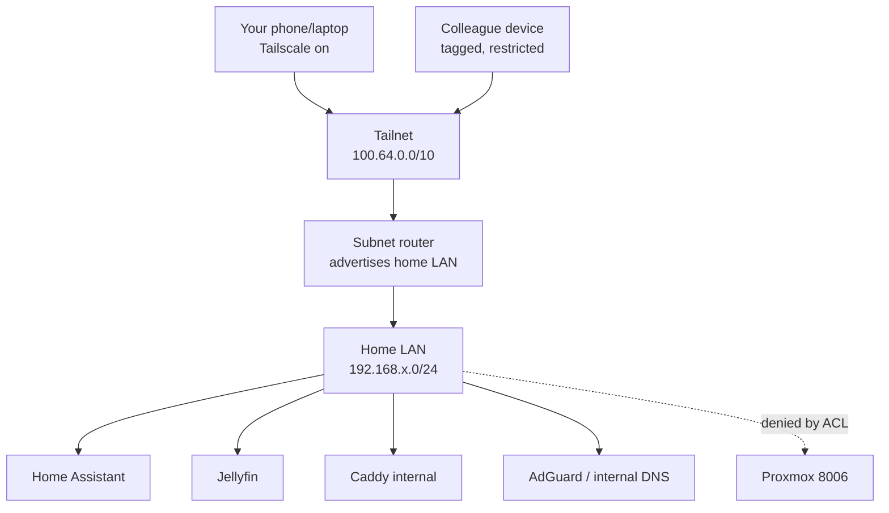

# Tailscale Plan: Private Remote Access + Split DNS

Status: draft for review.
Goal: reach the home LAN remotely over Tailscale using the same local URLs as at home, with deny-by-default sharing for colleagues.
Non-goals: publishing anything to the public Internet.

Context:

- Router WAN IPv4 matches the external IP, so no CGNAT blocks direct connectivity, but this plan opens no inbound ports.
- Posture is deny by default; every opening needs an explicit reason.
- Apps keep their local URLs; the VPN only extends layer-3 access to the LAN.
- `marx.home` stays internal and must resolve identically on LAN and over VPN.

## Target topology



Split DNS: Tailscale forwards `marx.home` to AdGuard over the tunnel, so remote devices get the same LAN IPs as at home. MagicDNS stays on for tailnet device names.

Access model: you get full LAN + admin access; colleagues get nothing by default and only named `service:port` grants (e.g. Jellyfin `8096`). Proxmox `8006`, SSH `22`, and DNS admin are never granted to colleagues.

## Phase 0 — Prerequisites

- [ ] Record home LAN CIDR (e.g. `192.168.15.0/24`).
- [ ] Record AdGuard/LAN DNS IP and served zones (`marx.home`).
- [ ] Decide which dedicated, otherwise empty LXC hosts the subnet router (router only, nothing else).
- [ ] Decide colleague list and which `service:port` each one may reach.
- [ ] Confirm tailnet admin account.

Done when: LAN CIDR, DNS IP, router host, and per-colleague grants are written down.

## Phase 1 — Install Tailscale

See `tailscale/install.sh` and `tailscale/README.md` for the automated steps. Manual parts:

- [ ] Create the tailnet with an identity you control (MFA on), note the tailnet name.
- [ ] Create the dedicated `tailscale-router` LXC (1 core / 512 MB, `no-auto-proxy` tag so Caddy never routes it).
- [ ] Run `bash tailscale/install.sh` on the Proxmox host (TUN passthrough + package install).
- [ ] Inside the LXC: `tailscale up`, then `tailscale set --advertise-routes=<LAN-CIDR>`.
- [ ] In the admin console: approve the subnet route, disable key expiry for the router node.
- [ ] Install Tailscale on laptop/phone with the same identity; on Linux run `tailscale set --accept-routes`.
- [ ] From off-LAN with VPN on, ping a LAN IP.

Done when: router shows logged in with the approved route, and your devices reach LAN IPs.

Reference: [Subnet routers](https://tailscale.com/kb/1019/subnets).

## Phase 2 — Verify self access

From an external network with VPN on:

- [ ] Open Home Assistant and Jellyfin with their existing local URLs (no app config changed).
- [ ] Confirm VPN off + away means no access (fail-closed).
- [ ] Confirm VPN off + home LAN means direct local access still works.

Done when: one URL per service works at home without VPN and away with VPN.

## Phase 3 — Split DNS

- [ ] In the Tailscale DNS page, add a split-DNS entry for `marx.home` pointing at the AdGuard IP (must be covered by the advertised route).
- [ ] From VPN and from LAN, compare: `nslookup app.marx.home` / `dig +short app.marx.home` must return the same LAN IP.
- [ ] Keep the zone internal-only; do not publish it publicly.

Done when: every service URL resolves identically on LAN and over VPN.

Reference: [Tailscale DNS](https://tailscale.com/kb/1054/dns).

## Phase 4 — Deny-by-default ACLs

- [ ] Default action is deny; your user keeps full access.
- [ ] Colleagues are named users with a tag such as `tag:team`, never a shared account.
- [ ] Grants allow only named `service:port` pairs, never the whole subnet by default.
- [ ] `autoApprovers` covers only your router identity.

Example shape (adapt users, CIDR, ports):

```json
{
  "groups": {
    "group:team": ["mate@example.com"]
  },
  "grants": [
    {
      "src": ["group:team"],
      "dst": ["192.168.15.0/24"],
      "ip": ["tcp:8096"]
    }
  ]
}
```

Done when: a test colleague account reaches exactly its granted `service:port` and nothing else.

## Phase 5 — Onboard colleagues

For each person:

- [ ] Record who, which service, which `hostname:port`, and why, plus a review date.
- [ ] Invite to the tailnet; they install Tailscale with their own identity.
- [ ] Apply tag + grant; test only the granted URL over mobile data with VPN on.
- [ ] Confirm Proxmox, SSH, and DNS admin are unreachable.

Done when: every external person maps to a written grant with a review date.

## Phase 6 — Operate

- [ ] Update Tailscale on router and clients; review policy and approved routes after every team/service change.
- [ ] Back up the tailnet policy on every change; keep a device inventory (owner, platform, tag, grants).
- [ ] Monthly: test remote access from an external network; test revocation with a spare account.

Done when: updates, reviews, backups, and revocation drills are routine.

## Information still needed

- Home LAN CIDR.
- AdGuard/LAN DNS IP and served zones.
- Chosen subnet-router host.
- Tailnet admin account.
- Colleague list with per-service grants.
