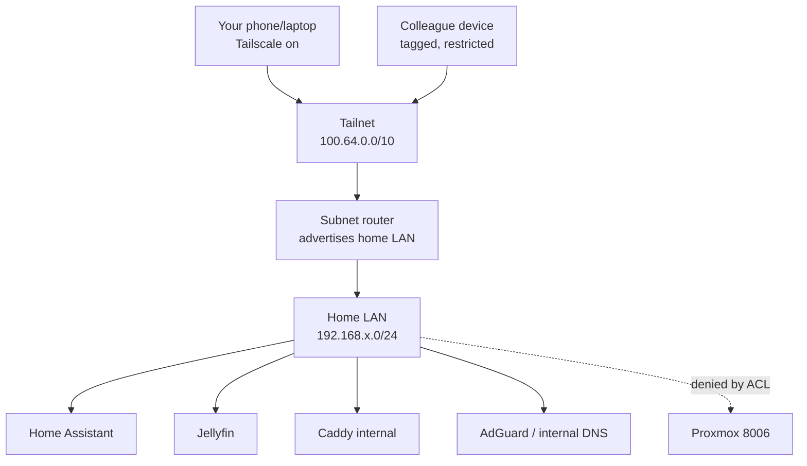
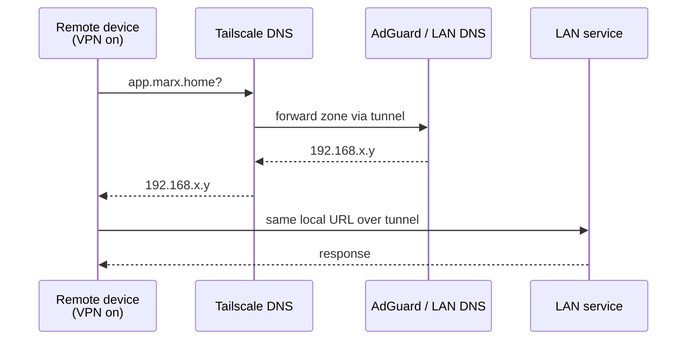
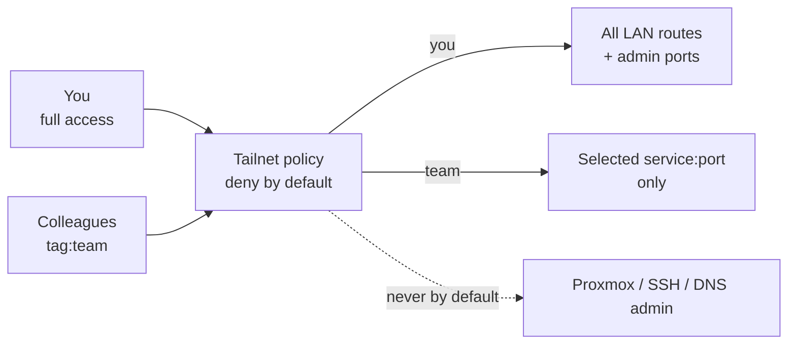

# Tailscale Plan: Private Remote Access + Split DNS

Status: draft for review.
Goal: reach the home LAN remotely over Tailscale using the same local URLs as at home, with deny-by-default sharing for colleagues.
Non-goals: publishing anything to the public Internet, creating the `nt-mtst`/MTST VM, installing Gitea Runner.

Companion document: `docs/internet-exposure-plan.md` stays as the perimeter reference. This plan is the VPN-only track and assumes no public `80/443` forwarding.

Confirmed context:

- Router WAN IPv4 matches the external IP, so no CGNAT blocks direct connectivity, but this plan opens no inbound ports anyway.
- Posture is deny by default; every opening needs an explicit reason.
- Apps keep their local URLs; the VPN only extends layer-3 access to the LAN.
- `marx.home` stays internal and must resolve identically on LAN and over VPN.

## Target topology



## DNS flow with split DNS



At home with VPN off, the same name resolves through the LAN DNS directly. One URL everywhere.

## Access model



## Phase 0 — Prerequisites and decisions

Objective: fix identities, subnets, and where the subnet router runs before touching anything.

Steps:

- [ ] Create or confirm the tailnet and its admin account.
- [ ] List your devices: laptop, phone, server node.
- [ ] Record the exact home LAN CIDR, for example `192.168.15.0/24`.
- [ ] Record AdGuard/LAN DNS IP and the zones it serves (`marx.home`).
- [ ] Decide which dedicated, otherwise empty LXC will host the subnet router (single-purpose guest; never co-locate it with another service).
- [ ] Decide the colleague list and which service:port each one may reach.
- [ ] Record the MTST boundary: the future team VM lives on a separate segment and is not part of these routes.

Done when: LAN CIDR, DNS IP, router host, and per-colleague grants are written down.

## Phase 1 — Install and configure Tailscale

Objective: tailnet account, subnet router on the server side, and Tailscale on your personal devices, with the LAN route approved and working.

Note: these steps run on the server and your devices, not on this macOS checkout. Nothing here is executed automatically.

### 1.1 Create the tailnet

- [ ] Sign up at [Tailscale](https://tailscale.com/) with an identity you control (preferably one with MFA).
- [ ] Note the tailnet name, for example `you.tail12345.ts.net`.
- [ ] Enable MFA on the identity provider account.
- [ ] Open the admin console at `https://login.tailscale.com/admin/machines` and keep it handy.

Done when: you can see the admin console and your tailnet name.

### 1.2 Create the dedicated router LXC

The community script only works on an existing LXC, so create a minimal dedicated container first. Keep it single-purpose: router only, no other services.

`RUN ON THE PROXMOX HOST` (or use Datacenter → Node → Create CT in the UI with the same values):

```bash
CTID=$(pvesh get /cluster/nextid)
pct create "$CTID" local:vztmpl/debian-13-standard_13.0-1_amd64.tar.zst \
  --hostname tailscale-router \
  --cores 1 --memory 512 --swap 256 \
  --rootfs local-lvm:8 \
  --unprivileged 1 \
  --features nesting=1 \
  --net0 name=eth0,bridge=vmbr0,ip=dhcp,firewall=1 \
  --onboot 1 --start 1 \
  --tags tailscale,router
```

Adjust the template file, storage (`local-lvm`), and bridge to match your host; list templates with `pveam list local` and confirm the bridge with `ip -br link`.

Checklist:

- [ ] Container `tailscale-router` exists and is running: `pct list`.
- [ ] It has a stable IP: `pct exec "$CTID" -- hostname -I` (prefer a DHCP reservation or static IP).
- [ ] It starts on boot (`onboot=1`).
- [ ] Nothing else runs in it.

Done when: the LXC is up, reachable, and still empty.

### 1.3 Install Tailscale in the LXC via community script

The subnet router runs in an existing LXC. Tailscale needs `/dev/net/tun`, which an LXC lacks by default; the script below adds the host-side passthrough and installs the package.

`RUN ON THE PROXMOX HOST`. Pin the script to the reviewed commit SHA instead of the mutable `main` ref, and verify the download before executing (review the script source first: `tools/addon/add-tailscale-lxc.sh` in community-scripts/ProxmoxVE):

```bash
curl -fsSL -o /tmp/add-tailscale-lxc.sh https://raw.githubusercontent.com/community-scripts/ProxmoxVE/08fdd8875172abcd3c167f13a00bdb65fcb0e61e/tools/addon/add-tailscale-lxc.sh
sha256sum /tmp/add-tailscale-lxc.sh
bash /tmp/add-tailscale-lxc.sh
```

The expected hash for that pinned commit is:

```text
ad8d26f949974a7611f9ed8a0cac7b3d83ac217546c3adbb434afbe4d3532617  /tmp/add-tailscale-lxc.sh
```

Abort on any mismatch. As an extra check, read through `/tmp/add-tailscale-lxc.sh` before executing it, so you run exactly the bytes you reviewed. Re-resolve the SHA if the upstream file changes, and re-review before adopting a new pin.

What the script does:

- Prompts for an existing LXC and appends `lxc.cgroup2.devices.allow: c 10:200 rwm` plus a `/dev/net/tun` bind mount to `/etc/pve/lxc/<CTID>.conf`.
- Installs the `tailscale` package inside the container (Alpine via `apk`, Debian/Ubuntu via the official Tailscale repo).
- Tags the container `tailscale`.

After the script finishes:

- [ ] Reboot the container so the TUN device appears.
- [ ] Verify inside the container: `ls -l /dev/net/tun`.
- [ ] Note the script stops before login: the steps below remain manual.

Then continue with IP forwarding and login inside the LXC (`RUN INSIDE THE LXC`):

Enable IP forwarding (inside the LXC):

```bash
echo 'net.ipv4.ip_forward = 1' | sudo tee -a /etc/sysctl.d/99-tailscale.conf
echo 'net.ipv6.conf.all.forwarding = 1' | sudo tee -a /etc/sysctl.d/99-tailscale.conf
sudo sysctl -p /etc/sysctl.d/99-tailscale.conf
```

Bring the node up and log in (prints a URL to authenticate in the browser):

```bash
sudo tailscale up
tailscale status
tailscale ip -4
```

Advertise the LAN route (replace with your real CIDR from Phase 0):

```bash
sudo tailscale set --advertise-routes=192.168.15.0/24
tailscale status
```

Then in the Tailscale admin console:

- [ ] Approve the advertised subnet route for the router device.
- [ ] Confirm the route shows as active.
- [ ] Disable key expiry for this server node, or tag it so expiry is off, to avoid silent loss of remote access.

Done when: `tailscale status` on the router shows logged in, with the subnet route advertised and approved.

### 1.4 Install Tailscale on your devices

- [ ] macOS laptop: install from the [Mac download](https://tailscale.com/download/mac), sign in with the same identity.
- [ ] Phone: install from the App Store / Play Store, sign in with the same identity.
- [ ] On each device, confirm it appears in the admin console machines list.

Linux clients must accept subnet routes explicitly:

```bash
sudo tailscale set --accept-routes
```

Android, iOS, macOS, and Windows pick up subnet routes automatically.

Official reference: [Subnet routers](https://tailscale.com/kb/1019/subnets).

Done when: your laptop and phone, off the home Wi-Fi, can ping a LAN IP through the tunnel.

## Phase 2 — Verify self access with unchanged URLs

Objective: prove the VPN extends the LAN before changing DNS or sharing anything.

With VPN on, from an external network (phone on mobile data):

- [ ] Ping the subnet router's tailnet IP.
- [ ] Ping a LAN IP, for example the Home Assistant host.
- [ ] Open Home Assistant with its existing local URL.
- [ ] Open Jellyfin with its existing local URL.
- [ ] Confirm no app configuration was changed: same host, same port, same scheme.
- [ ] Confirm VPN off plus away from home means no access (expected fail-closed behavior).
- [ ] Confirm VPN off plus home LAN means direct local access still works.

Done when: one URL per service works at home without VPN and away with VPN.

## Phase 3 — Split DNS so names match everywhere

Objective: `*.marx.home` resolves to the same LAN IPs on LAN and over VPN.

Background: Tailscale has its own DNS (MagicDNS). To keep local names, configure split DNS so the tailnet forwards your internal zone to AdGuard/LAN DNS through the tunnel. Do not publish the zone publicly.

Steps:

- [ ] In the Tailscale admin console DNS page, add a split-DNS entry for `marx.home` pointing at the AdGuard/LAN DNS IP reachable over the tunnel.
- [ ] Keep MagicDNS enabled for tailnet device names; it is additive, not a replacement.
- [ ] Do not use tailnet `100.x` IPs inside app configurations; apps keep LAN hostnames/IPs.
- [ ] From VPN, resolve a known name and compare with the LAN answer.
- [ ] From home LAN with VPN off, resolve the same name and compare.

Verification from any client:

```bash
nslookup app.marx.home
dig +short app.marx.home
```

Expected: identical LAN IP in both contexts.
Done when: every service URL used by apps resolves identically on LAN and over VPN.

Pitfalls to avoid:

- Public DNS override for the same zone would leak or break internal names; keep the zone internal-only.
- If AdGuard is reachable only on LAN, the split-DNS forwarder must point at an IP covered by the advertised subnet route.
- TTL: keep low during testing, raise after stable.

## Phase 4 — Deny-by-default ACLs

Objective: you have full access; colleagues have nothing until explicitly granted.

In the admin console access controls, apply least privilege:

- [ ] Default action is deny.
- [ ] Your user keeps full access to LAN routes and admin ports.
- [ ] Colleagues are invited as named users, never via a shared account.
- [ ] Colleagues get a tag such as `tag:team`.
- [ ] Grants allow only named service:port pairs, for example Jellyfin `8096`, never the whole subnet by default.
- [ ] Proxmox `8006`, SSH `22`, DNS admin, and AdGuard admin are excluded from colleague grants.
- [ ] Route approvals use `autoApprovers` only for your router identity, not for colleagues.
- [ ] Removing a colleague is a single revocation with no shared-secret rotation needed.

Example shape (adapt names, users, and ports):

```json
{
  "groups": {
    "group:team": ["mate@example.com"]
  },
  "grants": [
    {
      "src": ["group:team"],
      "dst": ["192.168.15.0/24"],
      "ip": ["tcp:8096"]
    }
  ]
}
```

Done when: a test colleague account reaches exactly its granted service:port and nothing else.

## Phase 5 — Onboard colleagues service by service

Objective: each sharing is explicit, minimal, and reversible.

For each colleague and service:

- [ ] Record who, which service, which hostname:port, and why.
- [ ] Invite the person to the tailnet; they install Tailscale and authenticate with their own identity.
- [ ] Apply the tag and grant; no full-subnet access unless justified in writing.
- [ ] Have them test only the granted URL while on mobile data with VPN on.
- [ ] Confirm they cannot reach Proxmox, SSH, or DNS admin.
- [ ] Set a review date for the grant.

Done when: every external person maps to a written grant with an expiry or review date.

## Phase 6 — Operate the tailnet

Objective: keep remote access reliable without widening it.

Recurring controls:

- [ ] Update Tailscale on the router host and clients.
- [ ] Review tailnet policy after every team or service change.
- [ ] Review approved subnet routes; remove stale ones.
- [ ] Monitor key expiry on the subnet router.
- [ ] Monitor failed auth and unexpected devices in the admin console.
- [ ] Back up the tailnet policy file on every change.
- [ ] Keep a device inventory: owner, platform, tag, grants.
- [ ] Test remote access monthly from an external network.
- [ ] Test revocation with a spare account before needing it in an incident.

Done when: updates, reviews, backups, and revocation drills are routine.

## Boundary with the MTST track

This plan deliberately excludes the team VM:

- The MTST VM will live on a separate segment with Proxmox firewall denying VM-to-LAN traffic.
- The team administers inside that VM; you administer host, firewall, and backups.
- Team VPN responsibility stays on their side (WireGuard inside their VM) or the VM joins this tailnet only under a heavily restricted tag, as a separate explicit decision.
- Runners execute arbitrary code and must never share a network with Home Assistant, Jellyfin, AdGuard, or Proxmox admin.

## Information still needed

- Home LAN CIDR.
- AdGuard/LAN DNS IP and served zones.
- Chosen subnet-router host (Proxmox host or dedicated VM).
- Your tailnet admin account.
- Colleague list with per-service grants.
- Public domain is out of scope here; no public DNS records are created by this plan.
